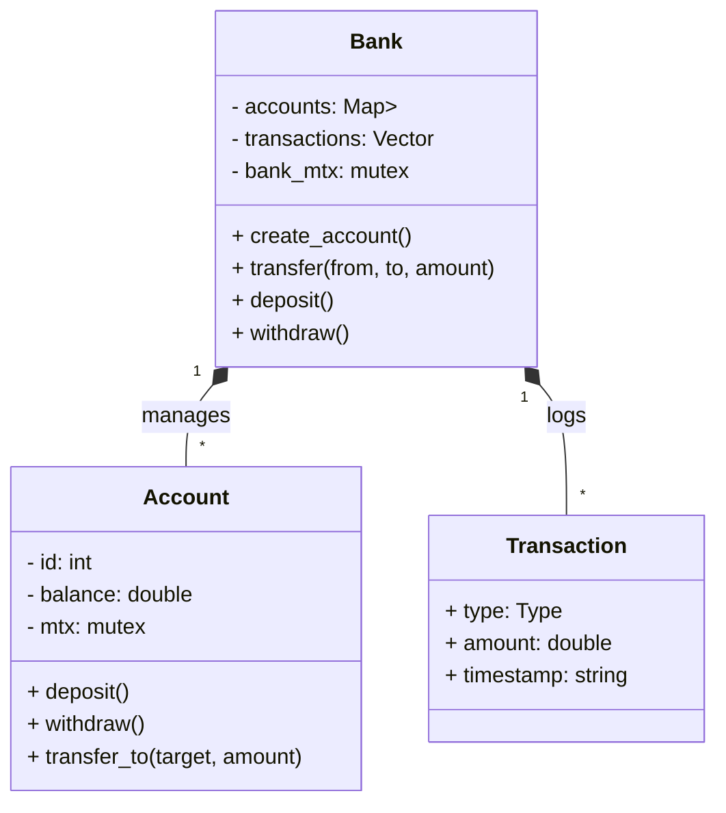

# System Design Document

## Architecture

The system follows a simple object-oriented architecture designed to simulate a banking environment with concurrent users.

### Components

1.  **Bank**: The central entity managing all accounts and the transaction log. It acts as the monitor for thread-safe access to the "database" (accounts map).
2.  **Account**: Represents a user's bank account. It encapsulates the balance and protects it with a mutex.
3.  **Transaction**: A simple data structure capturing details of an event (Deposit, Withdraw, Transfer).

### Concurrency Model

- **Granularity**: Locking is primarily done at the `Account` level.
    - `Bank` has a coarse-grained lock only for creating accounts and logging transactions (operations that modify the account list or transaction history).
    - `Account` operations (deposit, withdraw) use a fine-grained lock (`std::mutex`) per account.
- **Deadlock Prevention**:
    - For transfers involving two accounts, we use `std::lock(m1, m2)` which employs a deadlock-avoidance algorithm (typically ordering locks by address) to ensure that multiple locks are acquired safely.

### Class Diagram (Conceptual)

